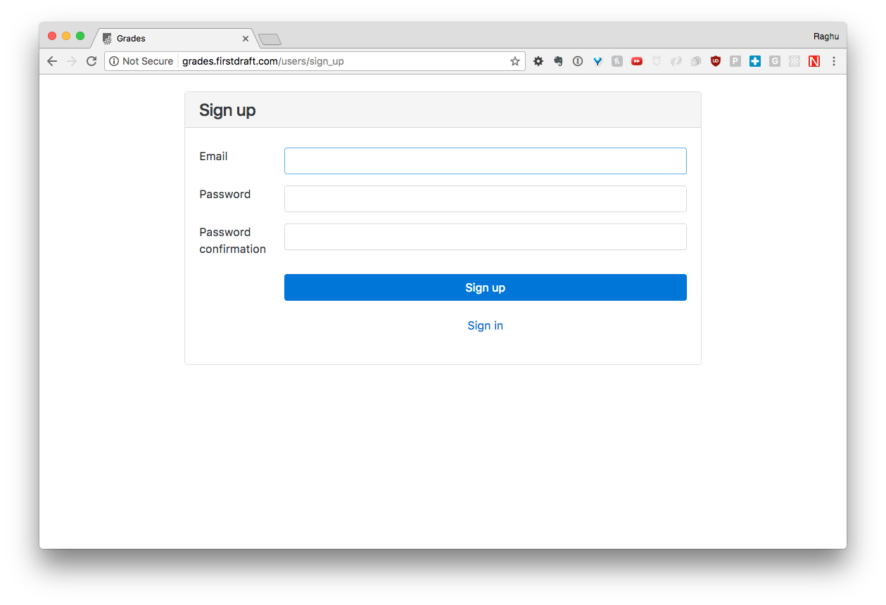
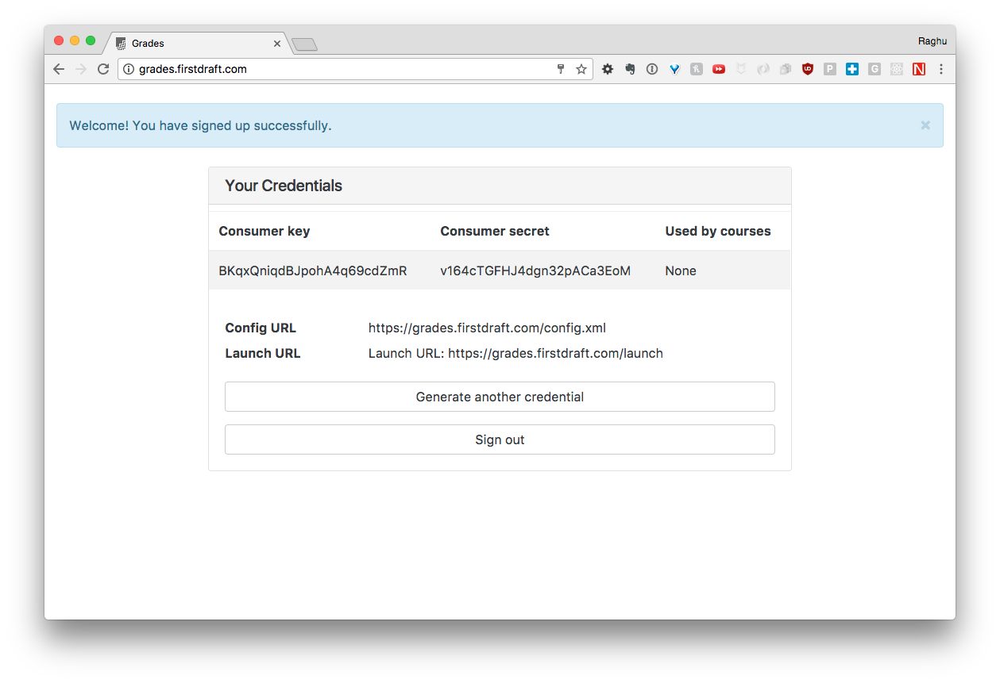
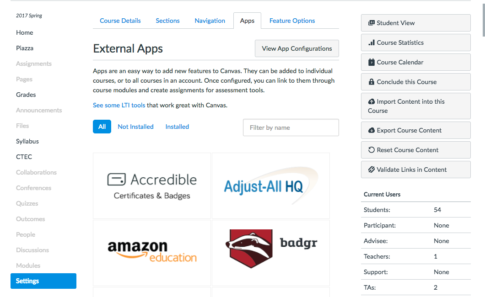
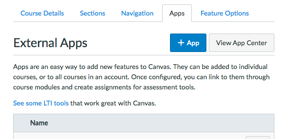
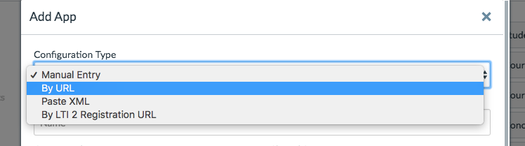
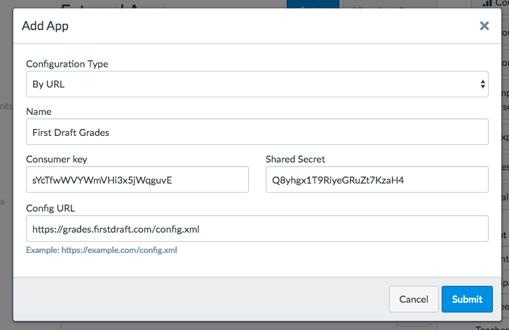

# Setting Up Canvas

## Adding an assignment

* Ensure that Display Grade As is set to "Points"
* Choose some points, doesn't really matter how many; this will be used to weight against your other Canvas assignments only
* Set Submission Type to "External Tool"
* External URL: [https://grades.firstdraft.com/launch](https://grades.firstdraft.com/launch)
* Don't click Find
* Set due date if you want
* Click Save
* Enter repo details on next screen
  * Owner: appdevspring17
  * Rep name: omnicalc

