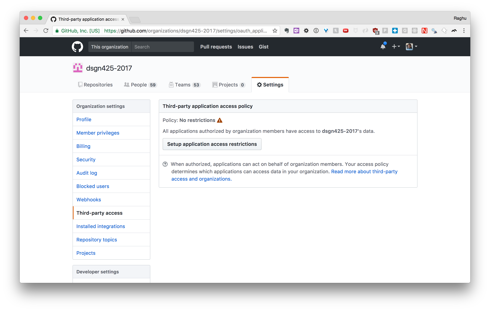

# Setting Up GitHub

> Do I signup for a class organization, select team \(starts at $25/month\) supply credit card info, etc. BEFORE I request education discount, OR signup for a free org, then ask for discount, and then I can promote to Team. I am assuming we want a Team organization that allows private repos — correct?

Sign up for a free org, then request a discount here:

[https://education.github.com/discount\_requests/new](https://education.github.com/discount_requests/new)

## Remove application restrictions

So Cloud9 can see private repos.

## Set default member privileges to "None"

